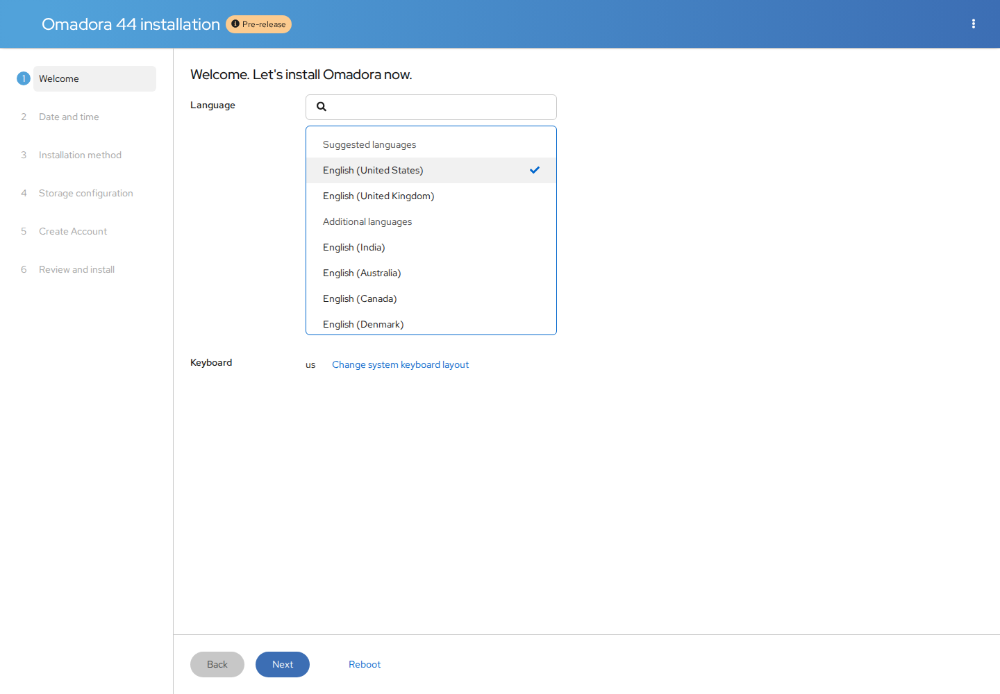

# Omadora offline installer

The v0.6.0-alpha ISO passed an offline UEFI installation and first-desktop test
on September 22, 2026. It is an alpha for hardware testing. Download the ISO
parts and joining helpers from the [v0.6.0-alpha release](https://github.com/DanielCoffey1/omadora/releases/tag/v0.6.0-alpha).
On Windows, put both parts, `Join-Omadora.cmd` and `Join-Omadora.ps1` in one
folder and double-click `Join-Omadora.cmd`. It combines and verifies the image.
Allow about 8 GB of free space. Linux/macOS instructions are on the release page.
GitHub's file-size limit requires two parts; the completed ISO is unchanged.
The normal command-line installer remains available for an existing fresh
Fedora Workstation installation.

Tested file: `Omadora-44-x86_64.iso`, 3,933,732,864 bytes.

```text
SHA256: 082bf82c7f10947971def9f13655181c3bde1f5ba29e168df029d6e1c9759f8f
```



## Intended installation flow

1. Open [Fedora Media Writer](https://github.com/FedoraQt/MediaWriter), choose the
   downloaded `Omadora-44-x86_64.iso`, and write it to an 8 GB or larger USB drive.
   Writing the image erases that USB drive.
2. Boot the USB and select **Install Omadora**.
3. Choose language, the destination disk and storage/encryption settings.
4. Create your account and password, review the disk changes, and install.
5. Reboot without the USB and sign in. Omadora initializes its configuration
   and Nepal wallpaper automatically on the first login.

There is no command to paste after installation. The account created in the
wizard opens Omadora by default. Once on the desktop, press **Super + Space**
for apps, **Super + K** for keybindings, or use the Omadora menu to browse,
add and remove wallpapers.

The ISO contains the OS, desktop, pywal16, previews and all 332 full-size
wallpapers. Installation and wallpaper selection do not require internet.
Downloading new apps or updates does require internet. GNOME is available as a
fallback session. Proprietary NVIDIA drivers remain an explicit optional setup.
Full-size image data lives separately from the versioned desktop runtime, so
ordinary desktop upgrades preserve the offline wallpaper collection.

The production installer has no hard-coded destination disk, unattended partitioning,
default user/password, autologin or debug access. Anaconda handles storage,
encryption, account creation and bootloader installation. First-login desktop
configuration runs as the signed-in user without sudo or network access.

## Build and verification

Run the **Omadora offline ISO** GitHub Actions workflow. It builds in a disposable
Fedora 44 container. Lorax composes a Fedora installer runtime with the modern
Anaconda Web UI, which is absent from the stock Everything netinstaller ISO.
The embedded image source and post-install setup use Anaconda's
`interactive-defaults.ks`; they do not activate automated Kickstart mode.
An [upstream browser-launcher fix](../iso/vendor/anaconda-webui/README.md) is
backported for the standalone Wayland session on installer media.
The runtime is combined with a complete root filesystem with pinned
Omadora/Omarchy sources. RPMs come from Fedora and
the same documented COPRs as the normal installer. The build records the exact
package inventory, source revision and final ISO SHA-256. Repository package
updates mean two builds of the same source may differ.

When reusing the v0.5.0-alpha build during a COPR outage, use both saved
components: system payload from run `35575539480` and installer runtime from
run `35566340967`. The successful v0.5.0-alpha run reused that installer runtime;
it did not upload a new copy. For the v0.6.0-alpha desktop:

```sh
gh workflow run iso.yml --ref main \
  -f reuse_payload=35575539480 \
  -f payload_source_ref=v0.6.0-alpha \
  -f reuse_installer=35566340967
```

These workflow artifacts have seven-day retention. Confirm they have not expired
before reusing them. This retains the prior Fedora package inventory and offline
wallpapers, replaces the desktop with the tagged release, and runs the same
offline installation test. Omitting `reuse_installer` composes a new runtime.

The test boots a separately instrumented copy through UEFI, installs onto a blank
60 GB virtual disk with WAN access blocked, and requires the user account to be
created through the installer. It then boots the installed disk with no ISO and
checks first-login configuration, SELinux, the desktop, and offline wallpaper
selection/import/removal. The test-only ISO is never included in public artifacts.
Test credentials and SSH access are injected only into the disposable guest.
The installed desktop uses a Bochs virtual display because host virgl stalled
the test VM. GDM autologin is enabled only in that test to exercise first-login
setup. Physical USB boot, normal password login on this ISO, Secure Boot, BIOS
boot, encrypted installation and hardware-specific behavior still need testing.
The ISO ships no autologin configuration or preset user password.

The desktop in the tested payload is from the v0.6.0-alpha tag
(`199df4664ed2a41d6bce880199ec25ce1dd10156`); installer packaging is from
`5c53400`. Fedora packages and the installer runtime were reused from the
previous successful ISO process described above. Preparation verifies
`systemd-pam`, which is required for GDM and user sessions with weak RPM
dependencies disabled. Desktop, wallpaper browser and installer-completion
screenshots from the passing run were reviewed.

Upstream references: [Lorax image embedding](https://weldr.io/lorax/mkksiso.html)
and [Anaconda configuration](https://github.com/rhinstaller/anaconda/blob/main/data/anaconda.conf).

For local development, use a disposable privileged Fedora 44 container with
`/src` mounted read-only and an empty output directory mounted at `/out`, then run
`bash /src/iso/build.sh`. Never run this image-building script on a normal host:
it mounts build filesystems and installs build tools. Allow at least 40 GB of
free build space. The normal user installer does not need privileged containers.
